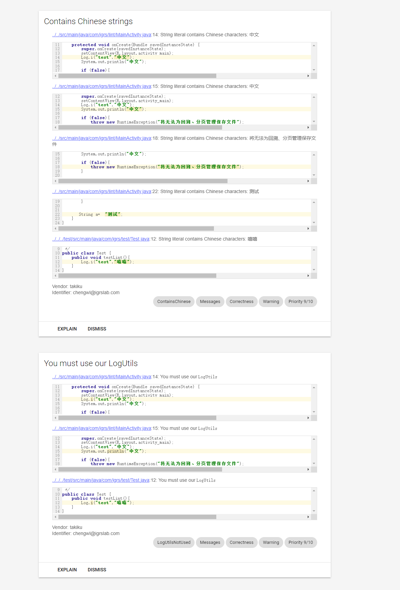

# Lint SDK
### 检测代码安全的库


### 一、功能介绍

1. 支持检测android的日志打印，包含Log.i、Log.d、Log.e等
2. 支持检测java的日志打印，包含 System.out.println、 System.out.print
3. 支持检测代码里中文字符串
4. 支持检测不安全的随机数，包含Random下的nextInt、nextLong、nextFloat、nextDouble
5. 支持检测不安全的http地址


### 二 、引用库
1. 添加仓库地址
```
allprojects {
		repositories {
			...
			maven { url 'https://jitpack.io' }
		}
	}
```
2. 在所有需要检测的模块中添加依赖
```
dependencies {
	        compileOnly 'com.igrs.tools:lint:1.0.3'
	}
```
3. 在主模块app下添加配置

```
android {
  lintOptions {
        abortOnError false    
        checkDependencies true
    }
}
```

### 三、使用方式
在gradle的Tasks的verification下有lint任务，执行你指定的渠道的lint，例如执行lintT86_fctS4kROWRelease任务。
在run下面会生成一个report地址，点击地址查看警告的地方。例如：

上述表示有56个中文字符串使用的地方和17个日志打印的地方，点击会跳转到具体代码块。


